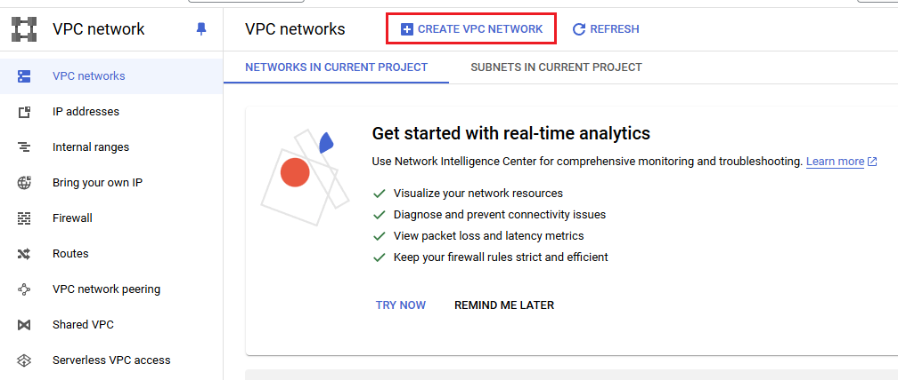
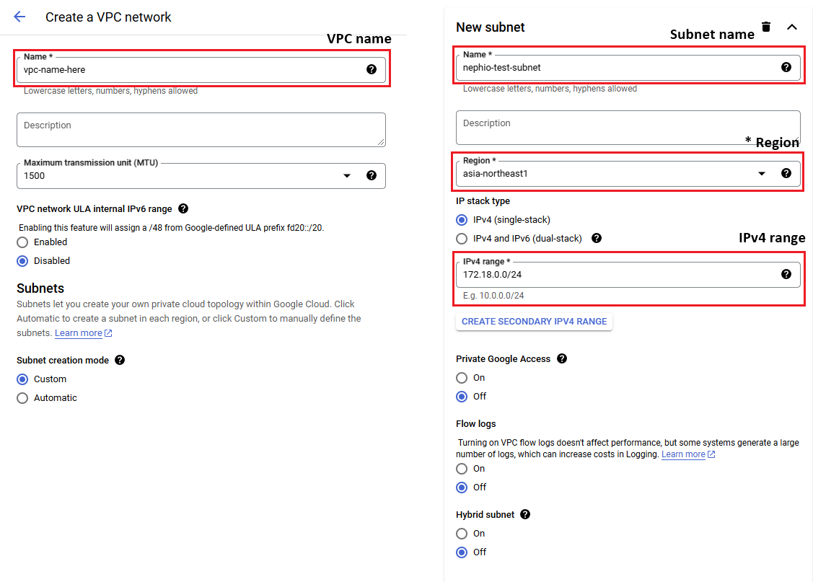
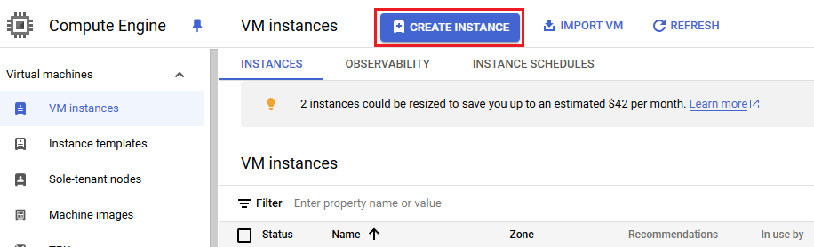
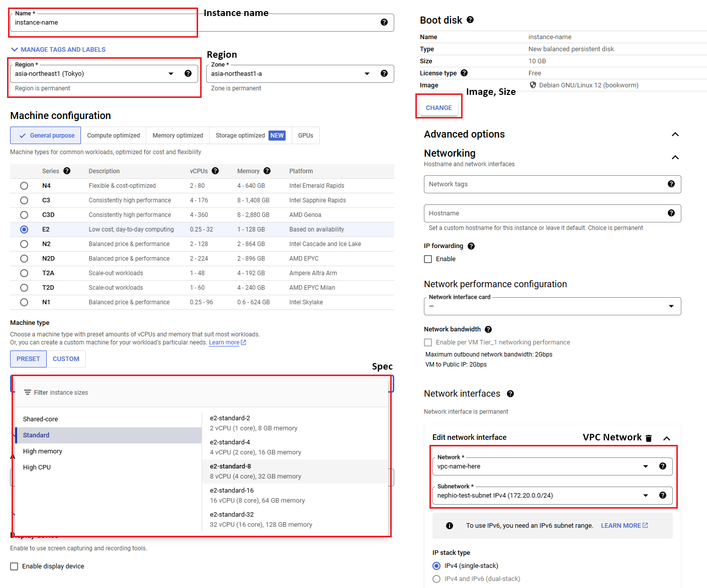

# 1. Prerequsites

## 1.1 Prepare Servers

The Nephio+Free5gc environment consists of 4 servers:

> Official GCP setup uses Kind to install and configure Nephio and Free5gc on a single server (8 vCPU and 8GB of RAM). \
> However, as we want to set up Nephio and Free5gc directly on servers, we need more resources.

> **NOTE:** You need to configure the following IP addresses depending on your environment.

|Type|Spec|K8s Cluster Name|IP Address|Pod CIDR|
|--|--|--|--|--|
|Nephio Mgmt|8 vCPU / 32GB RAM / 200GB | `mgmt` | 172.18.0.3 | 10.120.0.0/16 |
|Regional Cluster|8 vCPU / 8GB RAM / 200GB | `regional` | 172.18.0.4 | 10.121.0.0/16 |
|Edge01 Cluster|8 vCPU / 8GB RAM / 100GB | `edge01` | 172.18.0.5 | 10.122.0.0/16 |
|Edge02 Cluster|8 vCPU / 8GB RAM / 100GB | `edge02` | 172.18.0.6 | 10.123.0.0/16 |

### Set up VPC network for Nephio

Before creating the above instances (VMs) on GCP, you need to set up VPC and apply it to the instances.

Proceed in the following order to set up a VPC Network.

  1) Press CREATE button (VPC Network > CREATE VPC NETWORK)

      

2) Fill the required fields (VPC Name, Subnet Name, Region, IPv4 range) and press `CREATE` button

    > **IMPORTANT:** When selecting a region, ensure it matches the region of the VMs to which the VPC Network will be applied.

    

3) To apply the VPC Network to instances, follow these steps.

    (1) Compute Engine > CREATE INSTANCE

      

    (2) Write Instance name, Region, Spec

    > **IMPORTANT:** When we select the region, we must select the same region as VPC Network.

    (3) Press Boot disk > CHANGE and set Image, Size

    > **IMPORTANT:** When we press Boot disk > CHANGE, set Image Ubuntu 22.04 x86-64

    (4) Press Advanced options > Networking > Network interfaces and set VPC Network \
    (5) Press `CREATE` button

    

## 1.2 Install kubernetes

We use the following versions to set up Nephio and Free5gc.

- **Kubernetes**: v1.27.12
- **CRI**: Containerd
- **CNI**: Kindnet

### Install Kubernetes with containerd

```bash
##### -----=[ In ALL clusters ]=----- ####

# update repo
sudo apt-get update

# add gpg key
sudo apt-get install -y curl ca-certificates gnupg
sudo install -m 0755 -d /etc/apt/keyrings
curl -fsSL https://download.docker.com/linux/ubuntu/gpg | sudo gpg --dearmor -o /etc/apt/keyrings/docker.gpg
sudo chmod a+r /etc/apt/keyrings/docker.gpg

# add docker repository
echo "deb [arch="$(dpkg --print-architecture)" signed-by=/etc/apt/keyrings/docker.gpg] https://download.docker.com/linux/ubuntu "$(. /etc/os-release && echo "$VERSION_CODENAME")" stable" | sudo tee /etc/apt/sources.list.d/docker.list > /dev/null

# update the docker repo
sudo apt-get update

# install containerd
sudo apt-get install -y containerd.io

# set up the default config file
sudo mkdir -p /etc/containerd
sudo containerd config default | sudo tee /etc/containerd/config.toml
sudo sed -i "s/SystemdCgroup = false/SystemdCgroup = true/g" /etc/containerd/config.toml
sudo systemctl restart containerd

# add the key for Kubernetes repo
curl -fsSL https://pkgs.k8s.io/core:/stable:/v1.29/deb/Release.key | sudo gpg --dearmor -o /etc/apt/keyrings/kubernetes-apt-keyring.gpg

# add sources.list.d
echo 'deb [signed-by=/etc/apt/keyrings/kubernetes-apt-keyring.gpg] https://pkgs.k8s.io/core:/stable:/v1.29/deb/ /' | sudo tee /etc/apt/sources.list.d/kubernetes.list

# update repo
sudo apt-get update

# enable ipv4.ip_forward
sudo sysctl -w net.ipv4.ip_forward=1

# turn off swap filesystem
sudo swapoff -a

# install kubernetes
sudo apt-get install -y kubelet kubeadm kubectl

# exclude kubernetes packages from updates
sudo apt-mark hold kubelet kubeadm kubectl
```
### Create `config.yaml` file for each cluster

<details>
  <summary>mgmt_config.yaml</summary>
  
  ``` yaml
  apiVersion: kubeadm.k8s.io/v1beta3
  kind: ClusterConfiguration
  networking:
    podSubnet: "10.120.0.0/16"
  clusterName: "mgmt"
  ```
</details>

<details>
  <summary>regional_config.yaml</summary>
  
  ``` yaml
  apiVersion: kubeadm.k8s.io/v1beta3
  kind: ClusterConfiguration
  networking:
    podSubnet: "10.121.0.0/16"
  clusterName: "regional"
  ```
</details>

<details>
  <summary>edge01_config.yaml</summary>
  
  ``` yaml
  apiVersion: kubeadm.k8s.io/v1beta3
  kind: ClusterConfiguration
  networking:
    podSubnet: "10.122.0.0/16"
  clusterName: "edge01"
  ```
</details>

<details>
  <summary>edge02_config.yaml</summary>
  
  ``` yaml
  apiVersion: kubeadm.k8s.io/v1beta3
  kind: ClusterConfiguration
  networking:
    podSubnet: "10.123.0.0/16"
  clusterName: "edge02"
  ```
</details>

### Initialize Kubernetes with kubeadm

```bash
##### -----=[ In ALL clusters ]=----- ####

# enable br_netfilter
sudo modprobe br_netfilter
sudo bash -c 'echo 1 > /proc/sys/net/bridge/bridge-nf-call-iptables'

# initialize kubeadm
sudo kubeadm init --config=config.yaml --upload-certs

# make kubectl work for non-root user
mkdir -p $HOME/.kube
sudo cp -i /etc/kubernetes/admin.conf $HOME/.kube/config
sudo chown $(id -u):$(id -g) $HOME/.kube/config

# disable master isolation
kubectl taint nodes --all node-role.kubernetes.io/control-plane-
```

### Install Kindnet CNI

```bash
##### -----=[ In ALL clusters ]=----- ####

kubectl create -f https://raw.githubusercontent.com/aojea/kindnet/master/install-kindnet.yaml
kubectl get nodes

NAME   STATUS   ROLES           AGE    VERSION
np-m   Ready    control-plane   7d1h   v1.27.12
```

## 1.3 Install Packages

Nephio utilizes Ansible and kpt to deploy its packages.

### Install KPT

```bash
##### -----=[ In ALL clusters ]=----- ####

wget https://github.com/GoogleContainerTools/kpt/releases/download/v1.0.0-beta.44/kpt_linux_amd64
mv kpt_linux_amd64 kpt
chmod +x kpt
sudo mv ./kpt /usr/bin/
kpt version
```

### Install porchctl

```bash
##### -----=[ In ALL clusters ]=----- ####

wget https://github.com/nephio-project/porch/releases/download/v2.0.0/porchctl_2.0.0_linux_amd64.tar.gz
tar xvfz ./porchctl_2.0.0_linux_amd64.tar.gz 
sudo mv porchctl /usr/bin
porchctl version
```

### Install Docker

```bash
##### -----=[ In ALL clusters ]=----- ####

# We have already added the GPG key and repository for Docker during the installation of Containerd,
# so the following lines can be omitted.

# add gpg key
# sudo apt-get install -y ca-certificates gnupg
# sudo install -m 0755 -d /etc/apt/keyrings
# curl -fsSL https://download.docker.com/linux/ubuntu/gpg | sudo gpg --dearmor -o /etc/apt/keyrings/docker.gpg
# sudo chmod a+r /etc/apt/keyrings/docker.gpg

# add docker repository
# echo "deb [arch="$(dpkg --print-architecture)" signed-by=/etc/apt/keyrings/docker.gpg] https://download.docker.com/linux/ubuntu "$(. /etc/os-release && echo "$VERSION_CODENAME")" stable" | sudo tee /etc/apt/sources.list.d/docker.list > /dev/null

# update the docker repo
# sudo apt-get update

# install docker
sudo apt-get install -y docker-ce

# add user to docker group
sudo usermod -aG docker $USER

# bypass to run docker command
sudo chmod 666 /var/run/docker.sock
```

### Install Open vSwitch

In subsequent steps, we will connect SR Linux (Service Router Linux) from the `mgmt` network to other clusters (`edge01`, `edge02` and `regional`). To achieve multi-cluster connectivity via SR Linux, we will employ VXLAN using Open vSwitch.

```bash
##### -----=[ In ALL clusters ]=----- ####

# install open vSwitch
sudo apt-get install -y openvswitch-switch

# install networking tools especially for ifconfig
sudo apt-get install -y net-tools
```

### Install gtp5g, a Kernel module for 5G

```bash
##### -----=[ In regional, edge01, edge02 clusters ]=----- ####

wget https://github.com/free5gc/gtp5g/archive/refs/tags/v0.8.3.tar.gz
tar xvfz v0.8.3.tar.gz
cd gtp5g-0.8.3/
sudo apt-get install gcc gcc-12 make

# compile and build gtp5g module
sudo make
sudo make install
lsmod | grep gtp
```

## 1.4 Prepare Nephio

Nephio relies on `gitea`, which requires two hostPath PersistentVolumes (PVs). Originally, these were provisioned by `local-path-provisioner`. However, in this setup, we must manually create these PVs in the `mgmt` cluster because Nephio operates on a bare-metal environment.

```yaml
apiVersion: v1
kind: PersistentVolume
metadata:
  name: data-gitea-0
spec:
  capacity:
    storage: 10Gi
  accessModes:
    - ReadWriteOnce
  persistentVolumeReclaimPolicy: Retain
  volumeMode: Filesystem
  hostPath:
    path: /home/[USER]/nephio/gitea/data-gitea-0 # change here
---
apiVersion: v1
kind: PersistentVolume
metadata:
  name: data-gitea-postgresql-0
spec:
  capacity:
    storage: 10Gi
  accessModes:
    - ReadWriteOnce
  persistentVolumeReclaimPolicy: Retain
  volumeMode: Filesystem
  hostPath:
    path: /home/[USER]/nephio/gitea/data-gitea-postgresql-0 # change here
```

### Save the above YAML as 'gitea-pv.yaml' and apply it

```bash
##### -----=[ In mgmt cluster ]=----- ####

# modify gitea-pv.yaml
sed -i 's/[USER]/$USER/g' gitea-pv.yaml

# apply the yaml file to create 2 local path PVs
kubectl apply -f gitea-pv.yaml
```

<br></br>
---
|Index|Next|
|--|--|
|[ Go to Index Page](README.md) |  [ Go to Next Page ](2_install_nephio.md)|
