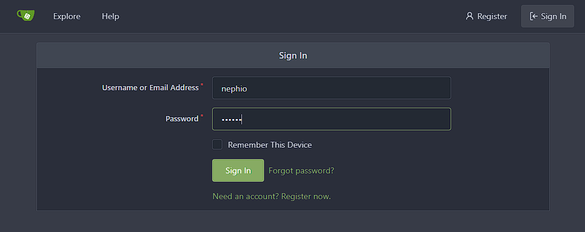
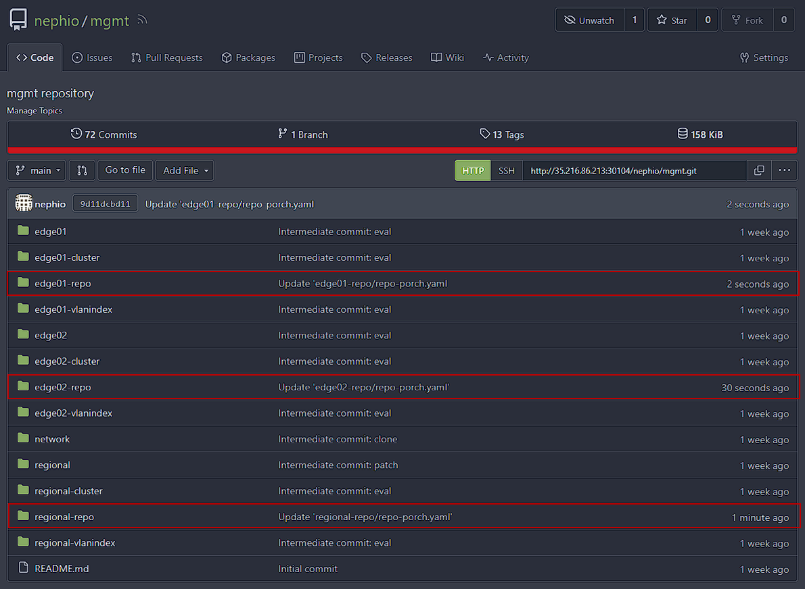

# 3. Adding K8s Clusters to Nephio

## 3.1 Registering Clusters to Nephio

### Add `regional` cluster to Nephio

In the `mgmt` cluster, use `porchctl` to register the `regional` cluster with the Nephio system.

> **NOTE:** As of Nephio R2, the `nephio-workload-cluster` is named `mgmt-08c26219f9879acdefed3469f8c3cf89d5db3868`. Please note that this name may change in future releases.

```bash
##### -----=[ In mgmt cluster ]=----- ####

# add regional cluster to nephio
kubectl get repositories
porchctl rpkg get --name nephio-workload-cluster
porchctl rpkg clone -n default catalog-infra-capi-b0ae9512aab3de73bbae623a3b554ade57e15596 --repository mgmt regional
porchctl rpkg pull -n default mgmt-08c26219f9879acdefed3469f8c3cf89d5db3868 regional
kpt fn eval --image gcr.io/kpt-fn/set-labels:v0.2.0 regional -- "nephio.org/site-type=regional" "nephio.org/region=us-west1"
porchctl rpkg push -n default mgmt-08c26219f9879acdefed3469f8c3cf89d5db3868 regional
porchctl rpkg propose -n default mgmt-08c26219f9879acdefed3469f8c3cf89d5db3868
porchctl rpkg approve -n default mgmt-08c26219f9879acdefed3469f8c3cf89d5db3868
```

### Add `edge01` and `edge02` clusters to Nephio:

In the previous step, we set up the `regional` cluster. However, as of now, Nephio does not recognize the `edge01` and `edge02` clusters. You can register these new clusters using the following command:

```bash
##### -----=[ In mgmt cluster ]=----- ####

# add edge01, edge02 cluster to nephio
kubectl apply -f test-infra/e2e/tests/free5gc/002-edge-clusters.yaml
```

### Check for repositories

Once Nephio approves the `regional`, `edge01`, and `edge02` clusters, it will assign git repositories in the `gitea` service. You can verify if the repositories have been successfully set up and registered by the Nephio system using the following commands:

```bash
##### -----=[ In mgmt cluster ]=----- ####

# check repositories resource
kubectl get repositories

NAME                        TYPE   CONTENT   DEPLOYMENT   READY   ADDRESS
...
edge01                      git    Package   true         False    http://172.18.0.200:3000/nephio/edge01.git
edge02                      git    Package   true         False    http://172.18.0.200:3000/nephio/edge02.git
mgmt                        git    Package   true         True     http://172.18.0.200:3000/nephio/mgmt.git
mgmt-staging                git    Package   false        True     http://172.18.0.200:3000/nephio/mgmt-staging.git
...
regional                    git    Package   true         False    http://172.18.0.200:3000/nephio/regional.git
```

> **IMPORTANT:** If you do not see all three clusters — `regional`, `edge01`, and `edge02` — it means Nephio has not yet completed setting up the clusters. Please wait a few more minutes for all repositories to appear.

### Check the `gitea` service

As you can see, the repositories are pointing to an incorrect `gitea` service address, which is set to an irrelevant IP address. We need to manually update the repository addresses in `gitea` to reflect the actual service address.

You can accomplish this by manually modifying the repository addresses using the `gitea` web interface. First, determine the `nodePort` of your `gitea` service, which is accessible from the external network, by:

```bash
kubectl get svc -n gitea

NAME                  TYPE           CLUSTER-IP       EXTERNAL-IP    PORT(S)                       AGE
gitea                 LoadBalancer   10.100.64.97     172.18.0.200   22:30941/TCP,3000:30104/TCP   7d3h
gitea-memcached       ClusterIP      10.100.218.39    <none>         11211/TCP                     7d3h
gitea-postgresql      ClusterIP      10.104.192.111   <none>         5432/TCP                      7d3h
gitea-postgresql-hl   ClusterIP      None             <none>         5432/TCP                      7d3h
```

Identify the nodePort that is mapped to port 3000.

For example, in our case, the `gitea` web interface can be accessed at `http://[mgmt_IP_address]:30104`.

### Login the `gitea` service

> **NOTE:** As of Nephio R2, the default login credentials are ID: `nephio` and password: `secret`.

  

Once logged in, navigate to the `nephio/mgmt` repository and modify the following files:

- `mgmt/regional-repo/repo-porch.yaml`
- `mgmt/edge01-repo/repo-porch.yaml`
- `mgmt/edge02-repo/repo-porch.yaml`



Except for the name, content in files is the same. 

We need to change the repo URL in the file to gitea_service_address.

### Replace address to gitea repository service address

```yaml
apiVersion: config.porch.kpt.dev/v1alpha1
kind: Repository
metadata:
  name: regional
  namespace: default
  annotations:
    internal.kpt.dev/upstream-identifier: config.porch.kpt.dev|Repository|default|example-cluster-name
    nephio.org/cluster-name: regional
spec:
  content: Package
  deployment: true
  git:
    branch: main
    directory: /
    repo: http://[gitea_service_address]/nephio/regional.git # change here
    secretRef:
      name: regional-access-token-porch
  type: git
```

After you commit the changes, the porch-system running in the `mgmt` cluster will detect the updates to the repositories.

### Check the repositories again

```bash
##### -----=[ In mgmt cluster ]=----- ####

kubectl get repositories

NAME                        TYPE   CONTENT   DEPLOYMENT   READY   ADDRESS
...
edge01                      git    Package   true         True    http://172.18.0.200:3000/nephio/edge01.git
edge02                      git    Package   true         True    http://172.18.0.200:3000/nephio/edge02.git
mgmt                        git    Package   true         True    http://172.18.0.200:3000/nephio/mgmt.git
mgmt-staging                git    Package   false        True    http://172.18.0.200:3000/nephio/mgmt-staging.git
regional                    git    Package   true         True    http://172.18.0.200:3000/nephio/regional.git
```

If the addresses are updated to the designated gitea service's IP, the `READY` field will change to `True`.

> **NOTE:** Even after updating the repository addresses in `gitea`, it may take some additional time for the changes to be applied to the Nephio system. If the status does not show as `True`, please wait a few more minutes for it to activate.

If this step is completed successfully, the `regional`, `edge01`, and `edge02` clusters will be able to join the Nephio system without any issues.

## 3.2 Clusters Joining Nephio

For the `regional` and `edge` clusters to join Nephio, they need `secrets` to access the `mgmt` cluster's `gitea` service. These secrets are automatically generated in step 3.1.

### Check secrets 

```bash
##### -----=[ In mgmt cluster ]=----- ####

kubectl get secrets --all-namespaces

NAMESPACE               NAME                                              TYPE                       DATA   AGE
...
default                 edge01-access-token-configsync                    kubernetes.io/basic-auth   3      6d21h
default                 edge01-access-token-porch                         kubernetes.io/basic-auth   3      6d21h
default                 edge02-access-token-configsync                    kubernetes.io/basic-auth   3      6d21h
default                 edge02-access-token-porch                         kubernetes.io/basic-auth   3      6d21h
default                 regional-access-token-configsync                  kubernetes.io/basic-auth   3      6d22h
default                 regional-access-token-porch                       kubernetes.io/basic-auth   3      6d22h
...
```

The secrets must be registered within the clusters."

For example, if the `regional` cluster gains access to the `mgmt` cluster's `gitea` service, it can also have the `regional-access-token-configsync`.

### Export secrets

```bash
##### -----=[ In mgmt cluster ]=----- ####

# save regional secrets to file
kubectl get secret regional-access-token-configsync -o yaml > regional-secret.yaml

# save edge01 secrets to file
kubectl get secret edge01-access-token-configsync -o yaml > edge01-secret.yaml

# save edge02 secrets to file
kubectl get secret edge02-access-token-configsync -o yaml > edge02-secret.yaml
```

### Change the secret files

Change the `namespace` to `config-management-system`.

```yaml
apiVersion: v1
data:
  password: OTE2YjNlZDlhZWQ5M2E5NTNjYjk1NTI1MmQ4YzBjN2QzMDk2Mzk3NA==
  token: OTE2YjNlZDlhZWQ5M2E5NTNjYjk1NTI1MmQ4YzBjN2QzMDk2Mzk3NA==
  username: bmVwaGlv
kind: Secret
...
  creationTimestamp: "YYYY-MM-DDThh:mm:ssZ"
  name: regional-access-token-configsync
  namespace: config-management-system # change here
  ownerReferences:
...
```

### Copy secrets to each cluster

```bash
##### -----=[ In mgmt cluster ]=----- ####

# send secret to regional cluster
scp regional-secret.yaml [regional_user]@[regional_IP_address]:/home/[regional_user]

# send secret to edge01 cluster
scp edge01-secret.yaml [edge01_user]@[edge01_IP_address]:/home/[edge01_user]

# send secret to edge02 cluster
scp edge02-secret.yaml [edge02_user]@[edge02_IP_address]:/home/[edge02_user]
```

### Install `configsync` in the clusters joining Nephio

```bash
##### -----=[ In regional, edge01, edge02 clusters ]=----- ####

kpt pkg get --for-deployment https://github.com/nephio-project/catalog.git/nephio/core/configsync@main
kpt fn render configsync
kpt live init configsync
kpt live apply configsync --reconcile-timeout=15m --output=table

kpt pkg get https://github.com/nephio-project/catalog.git/nephio/optional/rootsync@main
```

This will install `configsync` automatically and then apply secrets across clusters.

### Apply secrets in clusters

```bash
##### -----=[ In regional, edge01, edge02 clusters ]=----- ####

kubectl apply -f [secrets_filename].yaml
```

After applying secrets, we need to install `rootsync` on the clusters that are joining Nephio.

To enable `rootsync` to identify the target `gitea` service that the cluster requires access to, we must modify `rootsync/rootsync.yaml`.

### Modify `rootsync.yaml`

<details>
  <summary>regional rootsync.yaml</summary>
  
``` yaml
apiVersion: configsync.gke.io/v1beta1
kind: RootSync
metadata: 
  name: regional
  namespace: config-management-system
  annotations:
    internal.kpt.dev/upstream-identifier: 'configsync.gke.io|RootSync|config-management-system|example-cluster-name'
spec:
  sourceFormat: unstructured
  git:
    repo: http://[gitea_service_address]/nephio/regional.git # change here
    branch: main
    auth: token
    secretRef:
      name: regional-access-token-configsync
  ```
</details>

<details>
  <summary>edge01 rootsync.yaml</summary>
  
``` yaml
apiVersion: configsync.gke.io/v1beta1
kind: RootSync
metadata: 
  name: edge01
  namespace: config-management-system
  annotations:
    internal.kpt.dev/upstream-identifier: 'configsync.gke.io|RootSync|config-management-system|example-cluster-name'
spec:
  sourceFormat: unstructured
  git:
    repo: http://[gitea_service_address]/nephio/edge01.git # change here
    branch: main
    auth: token
    secretRef:
      name: edge01-access-token-configsync
  ```
</details>

<details>
  <summary>edge02 rootsync.yaml</summary>
  
``` yaml
apiVersion: configsync.gke.io/v1beta1
kind: RootSync
metadata: 
  name: edge02
  namespace: config-management-system
  annotations:
    internal.kpt.dev/upstream-identifier: 'configsync.gke.io|RootSync|config-management-system|example-cluster-name'
spec:
  sourceFormat: unstructured
  git:
    repo: http://[gitea_service_address]/nephio/edge02.git # change here
    branch: main
    auth: token
    secretRef:
      name: edge02-access-token-configsync
  ```
</details>

### Install `rootsync`

```bash
##### -----=[ In regional, edge01, edge02 clusters ]=----- ####

# apply changed rootsync files
kpt live init rootsync
kpt live apply rootsync --reconcile-timeout=15m --output=table
```

### Check `root-reconciler` scheduled

``` bash
##### -----=[ In regional, edge01, edge02 clusters ]=----- ####

kubectl get pods -n config-management-system

NAME                                          READY   STATUS    RESTARTS       AGE
config-management-operator-6946b77565-wxwvd   1/1     Running   0              6d20h
reconciler-manager-5b5d8557-wf69f             2/2     Running   0              6d20h
root-reconciler-regional-79949ff68-r5jvs      4/4     Running   87 (78m ago)   6d20h
```

### Check if `root-reconciler` can access gitea:

```bash
##### -----=[ In regional, edge01, edge02 clusters ]=----- ####

kubectl logs -n config-management-system root-reconciler-regional-79949ff68-r5jvs -c git-sync

INFO: detected pid 1, running init handler
I0415 hh:mm:ss 12 main.go:1101] "level"=1 "msg"="setting up git credential store"
...
I0415 hh:mm:ss 12 main.go:585] "level"=1 "msg"="next sync" "wait_time"=15000000000
I0415 hh:mm:ss 12 cmd.go:48] "level"=5 "msg"="running command" "cwd"="/repo/source/rev" "cmd"="git rev-parse HEAD"
I0415 hh:mm:ss 12 cmd.go:48] "level"=5 "msg"="running command" "cwd"="/repo/source/rev" "cmd"="git ls-remote -q http://172.18.0.200:3000/nephio/regional.git refs/heads/main"
I0415 hh:mm:ss 12 main.go:1065] "level"=1 "msg"="no update required" "rev"="HEAD" "local"="059047c546d8c944a3bca69c1c03e81fb9a52d14" "remote"="059047c546d8c944a3bca69c1c03e81fb9a52d14"
I0415 hh:mm:ss 12 main.go:585] "level"=1 "msg"="next sync" "wait_time"=15000000000
```

<br></br>
---
|Before|Next|
|--|--|
|[ Go to Before Page](2_install_nephio.md) | [ Go to Next Page ](4_configure_network_topology.md)|
